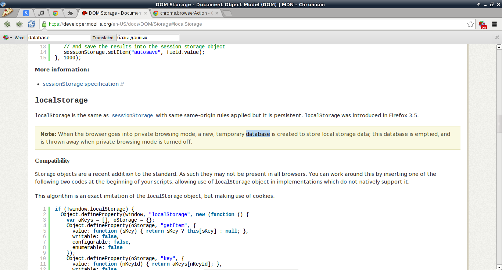

YATranslate
===========

Experimental in-page translate plugin for chrome browser, uses experimental infobar API.

Screenshot:

Install
=======

* clone somewhere: `git clone git://github.com/kucaahbe/chrome-translate-plugin.git`
* <b>Visit [chrome://extensions](chrome://extensions)</b> in your browser.
* Ensure that the <b>Developer Mode</b> checkbox in the top right-hand corner is checked.
* Click <b>Load unpacked extension…</b> to pop up a file-selection dialog.
* Navigate to the directory where cloned extension lives.
* Now you can turn off <b>Developer Mode</b> if you don't need it.

More info could be found here: http://developer.chrome.com/extensions/getstarted.html
